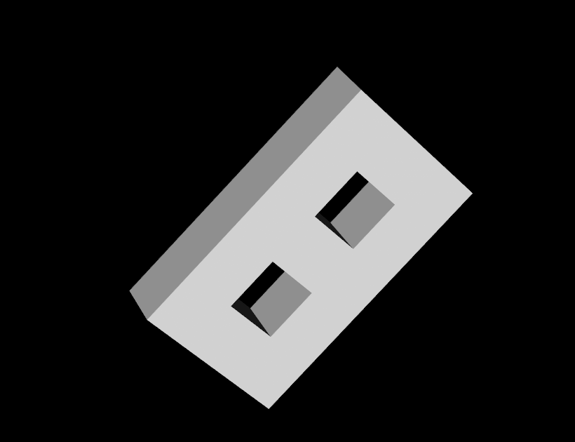
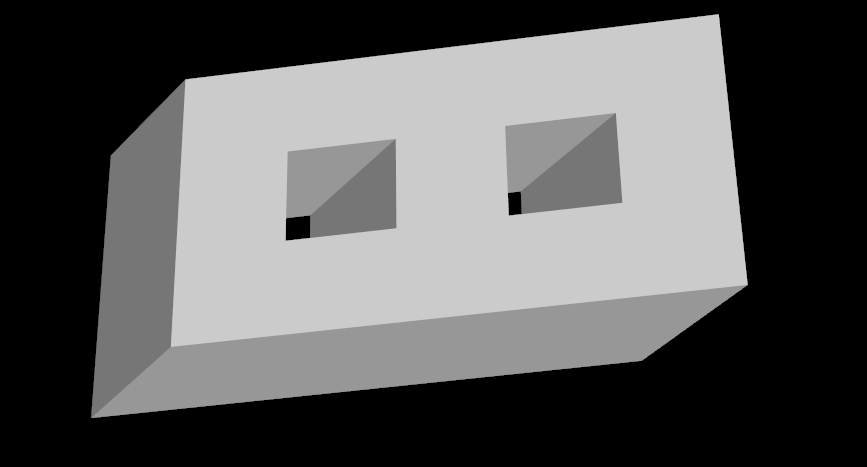

# EulerOperation

三维CAD作业，基于半边数据结构，实现五个基本欧拉操作和扫掠操作。允许二维区域带多个内环。需要特别说明的是项目中对于kemr的实现，在Draw.cpp的构造中，如果需要构造内环，在通过mev引出内环的第一个点后就需要随后立即执行kemr，而不是在构造完整个内环后再通过kemr将连接的边删去。这实际上是合理的，在完整的交互式界面下用户开始创建内环的第一个点我们就可以在后台调用一次mev和kemr，这将能够节省不少kemr以及mef的操作，带来效率上的提升。

## 项目说明

源代码放在`/src`目录下。

### 编译方法

模型的绘制绘制采用了VTK，因为VTK项目过大没有包含在本项目中。需自行下载编译并修改CMakeList中VTK_BASE_DIR。
cmake-build-debug文件夹下也放了几个编译好的exe文件。

> 本项目只在win11下完成了测试。

### 操作说明

通过鼠标点击移动控制旋转，滚轮变化大小，按下滚轮移动物体。

## 例子展示

包含了斜向扫掠和复杂多边形的例子。

